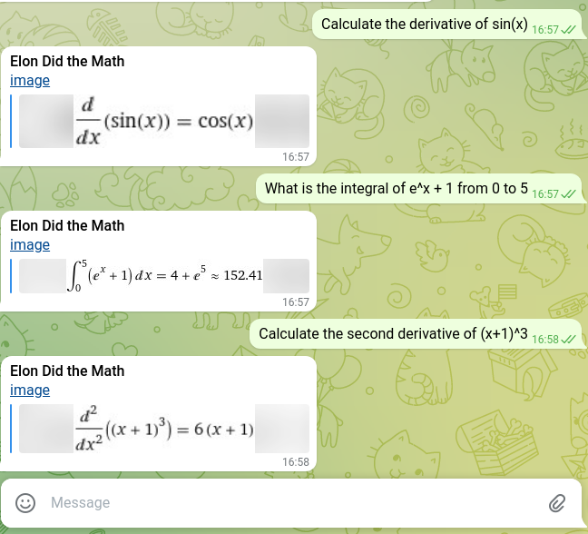

# Elon Musk Bot      

<p align="center"> 

</p>

Elon Musk Bot is a chatbot inspired by the entrepreneur and billionaire Elon Musk. It can answer questions about Tesla, SpaceX, cryptocurrencies, and more - give it a try!

## Talking to the Bot

The bot is available at https://t.me/COSC310_ElonMusk_Ivan_bot

## Executing Tests

[Install Python](https://realpython.com/installing-python/) on your machine and ensure you have the dependencies installed with:

```
pip install -r requirements.txt
```

To execute the tests, run the following command at the root of the repository:

```
python -m unittest discover tests
```
## Code Structure

```
    .
    ├── ElonMuskTalks                   # Code for the Python back-end
    │   ├── __init__.py                 # Entrypoint for Azure Cloud Function
    │   ├── intent_handlers.py          # Logic for each Intent (i.e. Topic) Elon can talk about
    │   ├── twitter_handler.py          # Elon can look up the latest tweets on the internet!
    │   ├── wolfram_handler.py          # Elon can do Calculus!
    ├── tests                           # Tests for the bot
    │   ├── data                        # Raw data from Dialogflow after Intent and Entity matching
    │   ├── mock_dialogflow_utils.py    # Utilities for writing tests
    │   ├── test_*.py                   # Multiple tests files for each intent
    └── README.md                       # This file!
```

## Features Added in Individual Project

### Twitter API (+5)

Elon likes Twitter so much that he bought 9% of it! Like the real Elon, our bot can also check Twitter. If you ask him for this latest tweet, he is going to share what he posted on @elonmusk. You can also ask what other people posted!

<p align="center"> 

</p>

In the conversation above, we ask Elon what he tweeted and it was a post mentioning Jeff Bezzos. Then, we ask Elon what Bezzos posted, and get the tweet. Lastly, we are curious about what other billionaires are tweeting hence we ask what Bill Gates posted too.

### Wolfram Alpha API (+5)

Elon has a bachelor's degree in Physics and likes doing math. Hence, we used the Wolfram Alpha API to let our Elon Musk bot do math just as the real Elon!

<p align="center"> 

</p>

In the conversation above, the bot answer questions such as "Calculate the second derivative of (x+1)^3" and displays the result as an image. 


## Built With

* [Python](https://www.python.org/) - Back End
* [Azure Cloud Functions](https://docs.microsoft.com/en-us/azure/azure-functions/) - Back End
* [Dialogflow](https://cloud.google.com/dialogflow/docs) - Natural Language Processing
* [Telegram](https://telegram.org/) - User Interface
* [tweepy](https://www.tweepy.org/) - Retrieving tweets
* [Wolfram Alpha API](https://products.wolframalpha.com/api/) - Doing Calculus

## Authors

- [Ivan Carvalho](https://github.com/IvanIsCoding)
